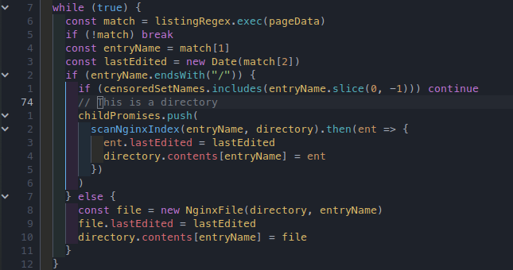

# indent-rainbowline.nvim

This plugin provides a way to generate [indent-blankline.nvim](https://github.com/lukas-reineke/indent-blankline.nvim/) configurations with rainbow indents, akin to the the [indent-rainbow](https://marketplace.visualstudio.com/items?itemName=oderwat.indent-rainbow) Visual Studio Code extension.



## Installation

Unlike most Neovim plugins, this plugin just provides configuration for another plugin, and can't be initialized on its own. Instead, it must be listed as a dependency for indent-blankline and used when configuring it.

### Lazy.nvim

```lua
{
	"lukas-reineke/indent-blankline.nvim",
	opts = function(_, opts)
		-- Other blankline configuration here
		return require("indent-rainbowline").make_opts(opts)
	end,
	dependencies = {
		"TheGLander/indent-rainbowline.nvim",
	},
}
```

### Packer.nvim

(This configuration has not been tested. Please submit an issue if it doesn't work)

```lua
use {
	"lukas-reineke/indent-blankline.nvim",
	config = function()
		opts = {}
		-- Other blankline configuration here
		require("indent_blankline").setup(require("indent-rainbowline").make_opts(opts))
	end,
	requires = {
		"TheGLander/indent-rainbowline.nvim",
	},
}
```

## Customization

To customize how the rainbow indentation looks, pass a second argument to `make_opts` when creating indent-blankline options.

```lua
return require("indent-rainbowline").make_opts(opts, {
	-- How transparent should the rainbow colors be. 1 is completely opaque, 0 is invisible. 0.07 by default
	color_transparency = 0.15,
	-- The 24-bit colors to mix with the background. Specified in hex.
	-- { 0xffff40, 0x79ff79, 0xff79ff, 0x4fecec, } by default
	colors = { 0xff0000, 0x00ff00, 0x0000ff, },
})
```
